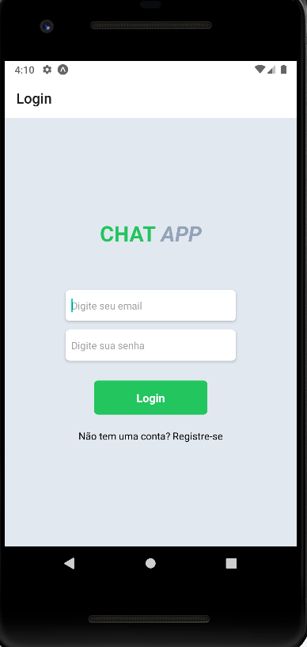
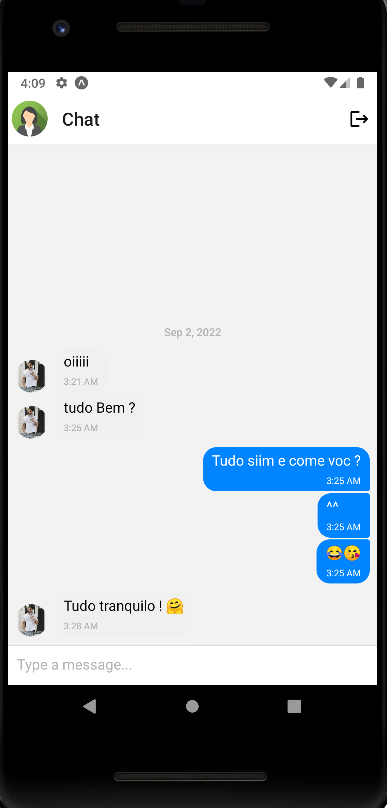
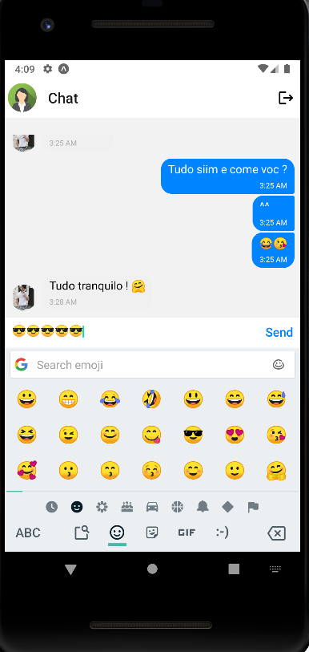

# Mobile CHAT APP

## Sobre
Um aplicativo mobile de chat criado usando algumas tecnologias interessantes

## Imagens





#### Tecnologias

- [Expo](https://expo.dev/)
- [React-Native](https://reactnative.dev/)
- [React-Native-Gifted-Chat](https://github.com/FaridSafi/react-native-gifted-chat)
- [TailwindCSS (TWRNC)](https://github.com/jaredh159/tailwind-react-native-classnames)

### Como usar?

Para começar você irá precisar ter instalado na sua máquina algumas ferramentas:
[Git](https://git-scm.com), [NodeJS v16.16.0](https://nodejs.org/en/) e também algum editor de código como
[VSCode](https://code.visualstudio.com/)

Depois desses pequenos passos, você vai precisar de um emulador ou configurar seu celular para utilizar o Expo,
caso opte pelo emulador segue abaixo um link com um tutorial: 

[Tutorial](https://www.youtube.com/watch?v=eSjFDWYkdxM&t=849s)

#### Abra seu git bash e cole o código abaixo:

```bash
# Para clonar o repositório:
$ git clone git@github.com:Av3z/chat-app.git

# Entre na pasta do projeto:
$ cd chat-app

# Para instalar as dependencias digite:
$ npm install

# Para iniciar o projeto:
$ npm start

# Caso queira ver seu projeto na web, logo após ele iniciar tecle W, caso queira iniciar no emulador tecle A
``` 